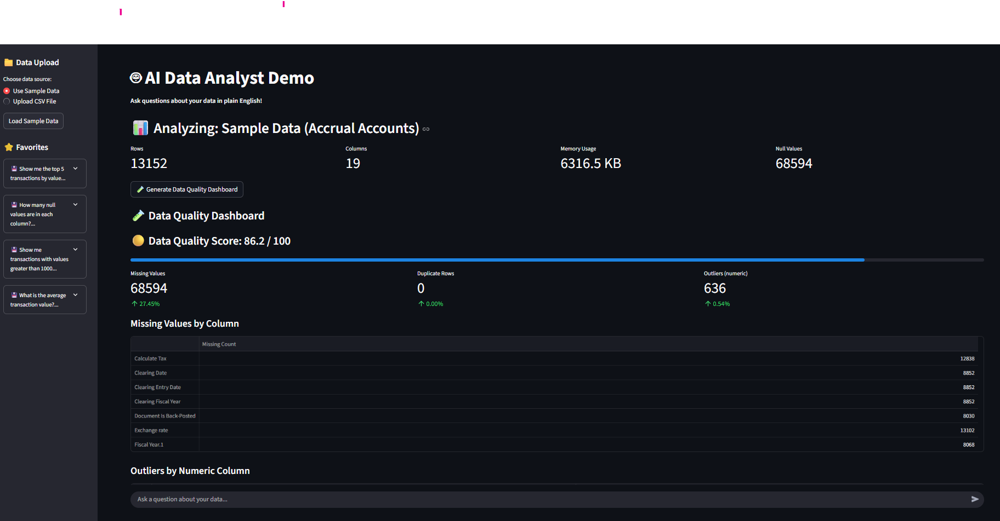

*Screenshot: Main interface of the AI Data Analyst Demo app*

# 🤖 AI Data Quality Demo

A Streamlit application that demonstrates how AI can be used as a "data analyst" to answer questions about data in plain English.

## Features

- **Natural Language Queries**: Ask questions about your data in plain English
- **AI-Powered SQL Generation**: Uses OpenAI GPT-4o-mini to convert questions into SQL queries
- **Interactive Chat Interface**: Chat-like experience for data exploration
- **File Upload Support**: Upload your own CSV files or use the provided sample data
- **Real-time Analysis**: Get instant answers to data questions
- **SQL Query Visibility**: See the generated SQL queries for transparency
- **Graceful Error Handling**: When queries fail, get helpful suggestions and recovery options
- **Query Modification Help** BROKEN: Interactive help to improve your questions
- **Data Schema Viewer** BROKEN: See column names, data types, and sample values
- **Retry Functionality** BROKEN: Easily retry failed queries with one click - generates a new SQL query for the same question

## Quick Start

Miro Board
https://miro.com/app/board/uXjVIg-t9RI=/
### Prerequisites
- Python 3.8 or higher
- OpenAI API key (included in the demo)

### Installation

1. **Install uv (fast Python package manager):**
   ```bash
   pip install uv
   ```

2. **Create and activate a virtual environment:**
   ```bash
   uv venv venv
   .\venv\Scripts\activate
   ```

3. **Install dependencies using uv:**
   ```bash
   uv pip install -r requirements.txt
   ```

4. **Run the application:**
   ```bash
   streamlit run data_chat_demo.py
   ```

3. **Open your browser** and navigate to the URL shown in the terminal (usually http://localhost:8501)

## How to Use

1. **Load Data**: 
   - Use the sidebar to either load the sample data or upload your own CSV file
   - The sample data contains financial transaction records

2. **Ask Questions**: 
   - Type questions in the chat interface
   - Use the example questions as a starting point
   - The AI will generate SQL queries and return results

3. **Explore Results**:
   - View the generated SQL queries by clicking "View SQL Query"
   - Results are displayed in a user-friendly format
   - Clear the chat anytime to start fresh

## Example Questions

- "How many rows are in the dataset?"
- "What is the total transaction value?"
- "Show me the top 5 transactions by value"
- "How many null values are in each column?"
- "What is the average transaction value?"
- "How many transactions are there per fiscal year?"
- "What are the unique business transaction types?"

## Error Handling

When a query fails to execute, the app provides:

1. **Clear Error Messages**: Explains what went wrong
2. **Generated SQL Display**: Shows the problematic query
3. **Helpful Suggestions**: Tips to improve your question
4. **Recovery Options**:
   - **Retry**: Generate a new SQL query
   - **Modify Question**: Get help rephrasing your question
   - **Show Schema**: View available columns and data types

**Common Issues & Solutions:**
- **Column names with spaces**: Use quotes or brackets in your question
- **Non-existent columns**: Check the schema for exact column names
- **Syntax errors**: Simplify your question or use the help interface
- **Failed queries**: Use the "Retry" button to generate a new SQL query for the same question

## Technical Architecture

- **Frontend**: Streamlit for the web interface
- **Data Processing**: Pandas for data manipulation
- **SQL Execution**: pandasql for running SQL on DataFrames
- **AI Integration**: OpenAI GPT-4o-mini for natural language to SQL conversion
- **Data Storage**: In-memory (no database required)

## Sample Data

The demo includes sample financial data with the following columns:
- Authorization Group
- Business Transaction Type

## Security Note

This demo includes a hardcoded OpenAI API key for demonstration purposes. In production, always use environment variables for API keys.

## Future Enhancements

- Support for multiple data sources
- Data visualization capabilities
- Export functionality
- Query history and favorites
- Advanced data quality checks 

## LLM Regression Testing with promptfoo

This project uses [promptfoo](https://www.promptfoo.dev/) as an LLM testing framework to ensure the reliability of SQL query generation. Specifically, promptfoo is set up for **regression testing**: it checks that user favorites—important or frequently used queries—continue to produce valid and expected results, even if the prompt template or underlying model changes.

- Test cases are generated from `data/favorites.json`.
- The prompt and test configuration are in the `promptfoo/` folder.
- To run the regression tests, see the instructions in `promptfoo/README.md`.

This helps maintain trust and consistency for users, as their favorite queries are always validated against any changes to the LLM setup. 